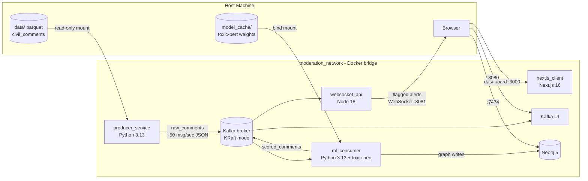

# Real-Time Moderation Engine


A high-throughput, distributed data pipeline that ingests simulated social media traffic, scores it for **toxicity and misinformation in real time**, maps malicious network clusters in a graph database, and streams flagged alerts to connected clients over WebSockets.

The project demonstrates production-grade MLOps, event-driven microservice architecture, and strict SOLID engineering — built as a fully local, Dockerized system.

## How It Works

The [`google/civil_comments`](https://huggingface.co/datasets/google/civil_comments) dataset (~97k test-split comments) is enriched with a synthetic social graph — user identities and reply chains — and streamed into Apache Kafka at a configurable rate. The **ML consumer** runs batched transformer inference, writes conversation graphs to Neo4j, and republishes scored payloads. The **WebSocket API** filters for flagged toxicity and broadcasts alerts to connected clients in real time. The **Next.js dashboard** renders a live alert feed and force-directed graph of toxic conversation clusters.

## Current Architecture

> **Status:** Complete — the full stack runs with a single `docker-compose up` command: producer → ML consumer → WebSocket bridge → Next.js dashboard.

The stack runs Kafka in **KRaft mode** (no Zookeeper). All containerized services share `moderation_network` and address each other by service name.



| Service | Image / Runtime | Purpose | Host Ports |
|---|---|---|---|
| `kafka` | `confluentinc/cp-kafka` (KRaft) | Event streaming backbone | `9092` |
| `kafka_ui` | `provectuslabs/kafka-ui` | Visual topic/consumer inspection | `8080` |
| `neo4j` | `neo4j:5-community` | Graph storage for user/comment networks | `7474`, `7687` |
| `producer_service` | Python 3.13 (custom image) | Streams enriched comments into Kafka | — |
| `ml_consumer` | Python 3.13 (custom image) | Batched toxicity inference + Neo4j writes | — |
| `websocket_api` | Node 18 Alpine (custom image) | Filters and broadcasts flagged comments over WebSocket | `8081` |
| `nextjs_client` | Node 18 Alpine (custom image) | Real-time SOC dashboard (live feed + force graph) | `3000` |

## Prerequisites

- **Docker Desktop** with Docker Compose
- **Python 3.13+** (only needed for the one-time dataset fetch; pandas 3.x requires ≥ 3.11)
- **~2 GB free disk** for the dataset, model cache, and Docker volumes

## Quick Start

```bash
# 1. Clone and enter the repo
git clone https://github.com/mj-weshh/realtime-moderation-engine.git
cd realtime-moderation-engine

# 2. One-time dataset fetch (the data/ folder is gitignored)
cd producer_service
python -m venv venv
venv\Scripts\activate        # Windows  |  source venv/bin/activate on macOS/Linux
pip install -r requirements.txt
python fetch_data.py
cd ..

# 3. Build and launch the full stack
docker-compose down -v
docker-compose up --build -d

# 4. Watch the pipeline
docker-compose logs -f producer_service
docker-compose logs -f ml_consumer
docker-compose logs -f websocket_api
docker-compose logs -f nextjs_client
```

The first `ml_consumer` build installs CPU-only PyTorch and transformers. The first container start downloads toxic-bert weights into `ml_consumer/model_cache/` (~500 MB one-time). The `nextjs_client` build runs a production Next.js compile (~1–2 minutes first time).

**Verify it's alive:**

- **Dashboard** — <http://localhost:3000> → live alert feed and force-directed graph update in real time as flagged comments stream in.
- Kafka UI — <http://localhost:8080> → `raw_comments` and `scored_comments` message counts climb.
- Neo4j Browser — <http://localhost:7474> (login `neo4j` / `testpassword`) → `MATCH (n) RETURN n LIMIT 25` shows User and Comment nodes.
- WebSocket — `npx wscat -c ws://localhost:8081` → flagged comment JSON streams in.
- Health — `curl http://localhost:8081/health` → `{"status":"ok"}`.

The producer streams the full 97k-comment dataset (~32 minutes at the default rate) and exits cleanly. Re-run it with `docker-compose up -d producer_service`.

For ML consumer setup (model download, inference, Neo4j smoke tests), see [docs/ml_inference.md](docs/ml_inference.md) or the MkDocs site.

## Documentation

Full documentation — architecture deep dive, local setup guide, data pipeline, ML inference, and WebSocket API reference — is built with MkDocs Material:

```bash
pip install mkdocs mkdocs-material
mkdocs serve
```

Then open <http://127.0.0.1:8000>.

## Project Structure

```
realtime-moderation-engine/
├── producer_service/    # Python service streaming enriched comments to Kafka
├── ml_consumer/         # Transformer inference, Neo4j graph writes, scored_comments
├── backend_api/         # Node.js Kafka consumer + WebSocket bridge (compose: websocket_api)
├── frontend/            # Next.js real-time dashboard (compose: nextjs_client)
├── docs/                # MkDocs pages, PRD, implementation plan
└── docker-compose.yml   # Single-command orchestration
```

## License

MIT — see [LICENSE](LICENSE).
