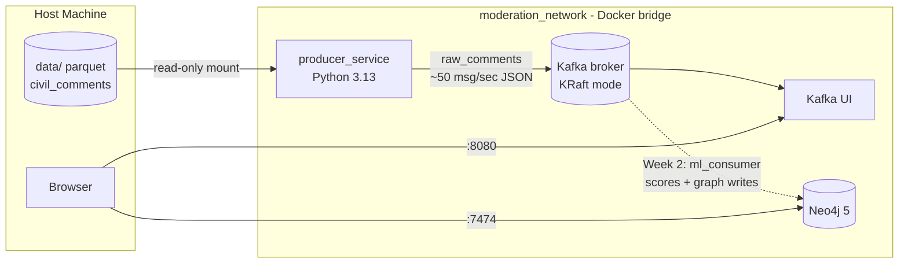

# Real-Time Moderation Engine


A high-throughput, distributed data pipeline that ingests simulated social media traffic, scores it for **toxicity and misinformation in real time**, maps malicious network clusters in a graph database, and (in upcoming phases) streams flagged alerts to a live command-center dashboard.

The project demonstrates production-grade MLOps, event-driven microservice architecture, and strict SOLID engineering — built as a fully local, Dockerized system.

## How It Works

The [`google/civil_comments`](https://huggingface.co/datasets/google/civil_comments) dataset (~97k test-split comments) is enriched with a synthetic social graph — user identities and reply chains — and streamed into Apache Kafka at a configurable rate, simulating live platform traffic. Downstream services (Week 2+) consume this stream, run transformer-based toxicity inference, persist conversation graphs to Neo4j, and push flagged events over WebSockets to a Next.js UI.

## Current Architecture

> **Status:** Week 1 complete — core infrastructure and the data producer are live. The ML inference consumer, WebSocket API, and frontend are under active development.

The stack runs Kafka in **KRaft mode** (no Zookeeper — Kafka 4.x removed it; the broker manages its own metadata quorum). All services share a custom Docker bridge network, `moderation_network`, and address each other by service name.



| Service | Image / Runtime | Purpose | Host Ports |
|---|---|---|---|
| `kafka` | `confluentinc/cp-kafka` (KRaft) | Event streaming backbone | `9092` |
| `kafka_ui` | `provectuslabs/kafka-ui` | Visual topic/consumer inspection | `8080` |
| `neo4j` | `neo4j:5-community` | Graph storage for user/comment networks | `7474`, `7687` |
| `producer_service` | Python 3.13 (custom image) | Streams enriched comments into Kafka | — |

## Prerequisites

- **Docker Desktop** with Docker Compose
- **Python 3.13+** (only needed for bare-metal development and the one-time dataset fetch; pandas 3.x requires ≥ 3.11)
- **~2 GB free disk** for the dataset and Docker volumes

## Quick Start

```bash
# 1. Clone and enter the repo
git clone https://github.com/mj-weshh/realtime-moderation-engine.git
cd realtime-moderation-engine

# 2. One-time dataset fetch (the data/ folder is gitignored)
cd producer_service
python -m venv venv
venv\Scripts\activate        # Windows  |  source venv/bin/activate on macOS/Linux
pip install -r requirements.txt
python fetch_data.py
cd ..

# 3. Build and launch the full stack
docker-compose up --build -d

# 4. Watch the producer stream
docker-compose logs -f producer_service
```

**Verify it's alive:**

- Kafka UI — <http://localhost:8080> → the `raw_comments` topic message count climbs at ~50 msg/sec.
- Neo4j Browser — <http://localhost:7474> (login `neo4j` / `testpassword`).

The producer streams the full 97k-comment dataset (~32 minutes at the default rate) and exits cleanly. Re-run it any time with `docker-compose up -d producer_service`.

## Documentation

Full documentation — architecture deep dive, local setup guide, and data pipeline reference — is built with MkDocs Material:

```bash
pip install mkdocs mkdocs-material
mkdocs serve
```

Then open <http://127.0.0.1:8000>.

## Project Structure

```
realtime-moderation-engine/
├── producer_service/    # Python service streaming enriched comments to Kafka
├── ml_consumer/         # (Week 2) Transformer inference + Neo4j graph writes
├── backend_api/         # (Week 2) Kafka -> WebSocket bridge
├── frontend/            # (Week 3) Next.js real-time dashboard
├── docs/                # MkDocs pages, PRD, implementation plan
└── docker-compose.yml   # Single-command orchestration
```

## License

MIT — see [LICENSE](LICENSE).
