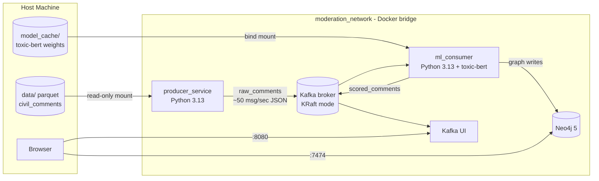

# Real-Time Moderation Engine


A high-throughput, distributed data pipeline that ingests simulated social media traffic, scores it for **toxicity and misinformation in real time**, maps malicious network clusters in a graph database, and (in upcoming phases) streams flagged alerts to a live command-center dashboard.


The project demonstrates production-grade MLOps, event-driven microservice architecture, and strict SOLID engineering — built as a fully local, Dockerized system.


## How It Works


The [`google/civil_comments`](https://huggingface.co/datasets/google/civil_comments) dataset (~97k test-split comments) is enriched with a synthetic social graph — user identities and reply chains — and streamed into Apache Kafka at a configurable rate, simulating live platform traffic. The **ML consumer** runs batched transformer inference, writes conversation graphs to Neo4j, and republishes scored payloads. Upcoming phases add a WebSocket bridge and Next.js dashboard.


## Current Architecture


> **Status:** Week 2 in progress — the ML inference consumer is live. The WebSocket API and frontend are under active development.


The stack runs Kafka in **KRaft mode** (no Zookeeper). All containerized services share `moderation_network` and address each other by service name. The ML consumer currently runs bare-metal for development.





| Service | Image / Runtime | Purpose | Host Ports |

|---|---|---|---|

| `kafka` | `confluentinc/cp-kafka` (KRaft) | Event streaming backbone | `9092` |

| `kafka_ui` | `provectuslabs/kafka-ui` | Visual topic/consumer inspection | `8080` |

| `neo4j` | `neo4j:5-community` | Graph storage for user/comment networks | `7474`, `7687` |

| `producer_service` | Python 3.13 (custom image) | Streams enriched comments into Kafka | — |
| `ml_consumer` | Python 3.13 (bare-metal) | Toxicity inference + Neo4j graph writes | — |

| `ml_consumer` | Python 3.13 (custom image) | Batched toxicity inference + Neo4j writes | — |


## Prerequisites


- **Docker Desktop** with Docker Compose

- **Python 3.13+** (only needed for bare-metal development and the one-time dataset fetch; pandas 3.x requires ≥ 3.11)

- **~2 GB free disk** for the dataset, model cache, and Docker volumes


## Quick Start


```bash

# 1. Clone and enter the repo

git clone https://github.com/mj-weshh/realtime-moderation-engine.git

cd realtime-moderation-engine


# 2. One-time dataset fetch (the data/ folder is gitignored)

cd producer_service

python -m venv venv

venv\Scripts\activate        # Windows  |  source venv/bin/activate on macOS/Linux

pip install -r requirements.txt

python fetch_data.py

cd ..


# 3. Build and launch the full stack

docker-compose up --build -d


# 4. Watch the pipeline

docker-compose logs -f ml_consumer

docker-compose logs -f producer_service

```


!!! note "First ml_consumer build"

    The first image build installs PyTorch and transformers. CPU-only PyTorch is pinned to keep this fast. The first container start also downloads toxic-bert weights into `ml_consumer/model_cache/` (~500 MB one-time).


**Verify it's alive:**


- Kafka UI — <http://localhost:8080> → `raw_comments` and `scored_comments` message counts climb.

- Neo4j Browser — <http://localhost:7474> (login `neo4j` / `testpassword`) → `MATCH (n) RETURN n LIMIT 25` shows User and Comment nodes.


The producer streams the full 97k-comment dataset (~32 minutes at the default rate) and exits cleanly. Re-run it with `docker-compose up -d producer_service`.

For ML consumer setup (model download, inference, Neo4j smoke tests), see [docs/ml_inference.md](docs/ml_inference.md) or the MkDocs site.


## Documentation


Full documentation — architecture deep dive, local setup guide, data pipeline, and ML inference reference — is built with MkDocs Material:


```bash

pip install mkdocs mkdocs-material

mkdocs serve

```


Then open <http://127.0.0.1:8000>.


## Project Structure


```

realtime-moderation-engine/

├── producer_service/    # Python service streaming enriched comments to Kafka

├── ml_consumer/         # Transformer inference, Neo4j graph writes, scored_comments

├── backend_api/         # (Week 2) Kafka -> WebSocket bridge

├── frontend/            # (Week 3) Next.js real-time dashboard

├── docs/                # MkDocs pages, PRD, implementation plan

└── docker-compose.yml   # Single-command orchestration

```


## License


MIT — see [LICENSE](LICENSE).

