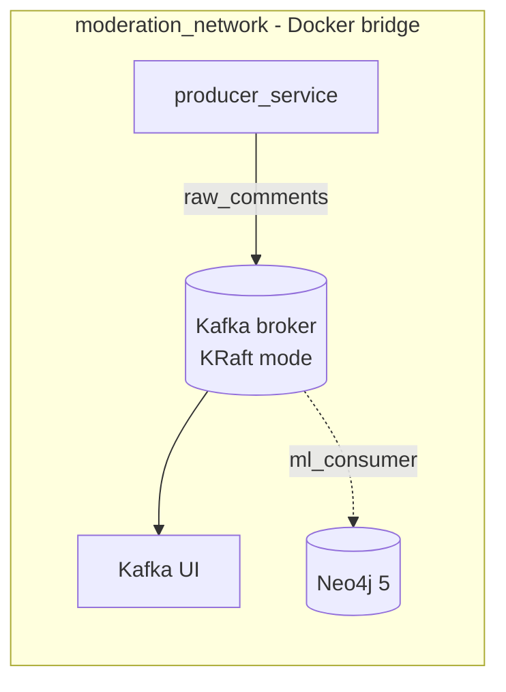

# Architecture

The system is built as **decoupled, containerized microservices** connected by an event streaming backbone. No service calls another directly; everything flows through Kafka topics. This page explains the design decisions behind the infrastructure and the ml_consumer module split.

## The Decoupled Microservice Approach



Each service has exactly one responsibility:

| Service | Responsibility | Scaling story |
|---|---|---|
| `producer_service` | Simulate platform traffic at a configurable rate | Run multiple instances for higher throughput |
| `ml_consumer` | Batched toxicity inference + Neo4j graph persistence | Bare-metal today; Docker in a future phase |
| `kafka` | Buffer, order, and durably store the event stream | Partitions allow parallel consumers |
| `neo4j` | Persist the social graph (users, comments, reply edges) | Independent of stream throughput |
| `kafka_ui` | Operational visibility into topics and consumers | Dev tooling only |

Because services only share message *contracts* (JSON schemas, documented in [Data Pipeline](data_pipeline.md)), each one can be developed, deployed, crashed, and restarted independently — the foundation for the fault-tolerance requirements in the PRD.

## Why Kafka?

A message queue between the producer and the ML consumer solves three problems that a direct HTTP call cannot:

1. **Throughput mismatch.** The producer emits ~50 msg/sec; transformer inference is slower and bursty. Kafka absorbs the difference — the consumer pulls batches at its own pace instead of being overwhelmed.
2. **Durability and replay.** Messages are persisted with offsets. If the ML consumer crashes mid-stream, it resumes from its last committed offset with zero data loss (PRD fault-tolerance requirement). During development, a consumer can replay the whole topic from offset 0.
3. **Fan-out.** One event stream feeds multiple independent consumers (inference, analytics, archiving) without producers knowing or caring.

## Why KRaft Instead of Zookeeper?

Kafka historically delegated cluster metadata — broker membership, topic configuration, controller election — to a separate **Zookeeper** ensemble. That meant two distributed systems to deploy, monitor, and secure.

**KRaft** (Kafka Raft) replaces Zookeeper with a Raft-based metadata quorum built into Kafka itself. It became the default in Kafka 3.x, and **Kafka 4.0 removed Zookeeper support entirely** — which this project discovered empirically: our original Zookeeper-based compose configuration failed on `confluentinc/cp-kafka` 8.x (`Error: environment variable "KAFKA_PROCESS_ROLES" is not set`), prompting the migration.

Our single-node setup runs in **combined mode** — one process acts as both broker and controller:

```yaml
KAFKA_PROCESS_ROLES: broker,controller
KAFKA_NODE_ID: 1
KAFKA_CONTROLLER_QUORUM_VOTERS: 1@kafka:29093
```

Benefits for this project: one fewer container, faster startup, no split-brain configuration between two systems, and alignment with where Kafka actually is today.

## Listener Topology

The broker exposes three listeners, each for a distinct audience:

| Listener | Address | Audience |
|---|---|---|
| `PLAINTEXT` | `kafka:29092` | Containers on `moderation_network` (producer, future consumers, Kafka UI) |
| `PLAINTEXT_HOST` | `localhost:9092` | Tools and scripts running on the host machine |
| `CONTROLLER` | `kafka:29093` | KRaft metadata quorum traffic only |

Why two application listeners? A Kafka client bootstraps by asking the broker for its *advertised* address, then connects there. A container resolving `kafka` via Docker DNS needs `kafka:29092`; a host process needs `localhost:9092`. Advertising both lets the same broker serve both worlds.

## The Custom Bridge Network

All services attach to `moderation_network`, a user-defined Docker bridge. Unlike the default bridge, user-defined networks provide **DNS resolution by service name** — the producer reaches the broker at `kafka:29092` regardless of what IP Docker assigns the container. No hardcoded IPs, no fragile `links`.

## Why Neo4j?

Toxicity rarely happens in isolation — it clusters in reply chains and brigading patterns. Modeling users and comments as a **property graph** makes those patterns first-class:

```text
(User)-[:POSTED]->(Comment)-[:REPLIES_TO]->(Comment)<-[:POSTED]-(User)
```

Queries like "find users whose replies to each other are consistently toxic" are single Cypher traversals in Neo4j but painful multi-join queries in a relational store. Graph population logic lives in `ml_consumer/database.py` — see [ML Inference](ml_inference.md) for the Cypher and connection details. Data persists across container restarts via a bind mount (`./neo4j_data:/data`).

## Design Constraints Carried Forward

- **Single-broker, single-partition** topics are fine for a local demo but are called out explicitly (`KAFKA_OFFSETS_TOPIC_REPLICATION_FACTOR: 1`) — production would use 3+ brokers.
- **Model weights and datasets never enter images or git** — datasets live in `data/`, model weights in `ml_consumer/model_cache/`; both are gitignored, keeping images slim and the repo lightweight.
- **Offsets commit only after downstream writes succeed** (Day 9 consumer requirement) — the delivery guarantee chain is designed end to end. The inference and graph modules (`inference.py`, `database.py`) are already separated from the future Kafka loop (`main.py`) to satisfy the PRD's SOLID requirement.
