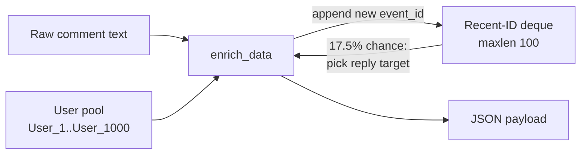

# Data Pipeline

This page documents the event stream itself: the Kafka topics, the JSON contracts flowing through them, and how the producer manufactures a realistic social network out of a flat comment dataset.

## Source Dataset

The pipeline streams the **test split** of [`google/civil_comments`](https://huggingface.co/datasets/google/civil_comments) — 97,320 real, human-written comments from the Civil Comments platform. The full dataset (train/validation/test) is fetched by `producer_service/fetch_data.py` and stored locally as parquet; the producer reads a lightweight text-only subset (`data/comments_subset.parquet`).

The original dataset is flat — no users, no threads. The producer synthesizes that structure (below) because the downstream graph analysis needs relational metadata.

## Kafka Topics

| Topic | Producer | Consumer | Status |
|---|---|---|---|
| `raw_comments` | `producer_service` | `ml_consumer` (Day 9 Kafka loop) | **Live** |
| `scored_comments` | `ml_consumer` (Day 9) | `backend_api` (Week 2) | Logic ready; not yet published |

Both topics currently use a single partition on a single broker — sufficient for the local demo, and the consumer-side batching is designed to scale to partitioned topics unchanged.

## Payload Schema: `raw_comments`

Every message is a UTF-8 JSON object:

```json
{
  "event_id": "44096c6d-b283-4c1d-8341-80ee94dc027a",
  "user_id": "User_182",
  "text": "The actual comment text goes here.",
  "timestamp": "2026-07-04T21:09:39.170546Z",
  "reply_to_id": null
}
```

| Field | Type | Description |
|---|---|---|
| `event_id` | `string` (UUIDv4) | Unique identifier for this comment event |
| `user_id` | `string` | Synthetic author, drawn from a fixed pool `User_1` … `User_1000` |
| `text` | `string` | Verbatim comment text from the dataset |
| `timestamp` | `string` (ISO-8601 UTC, `Z` suffix) | Generation time of the event |
| `reply_to_id` | `string` or `null` | `event_id` of the comment this replies to; `null` for top-level comments |

## Payload Schema: `scored_comments`

The ML consumer republishes each message with inference results appended. Scoring logic is implemented in `inference.py`; Kafka publishing is added in Day 9. See [ML Inference](ml_inference.md) for how probabilities are computed.

```json
{
  "event_id": "44096c6d-...",
  "user_id": "User_182",
  "text": "...",
  "timestamp": "2026-07-04T21:09:39.170546Z",
  "reply_to_id": null,
  "scores": {
    "toxicity": 0.9859,
    "severe_toxicity": 0.3496,
    "obscene": 0.5458,
    "threat": 0.8785,
    "insult": 0.7339,
    "identity_attack": 0.0683
  },
  "is_flagged": true
}
```

### `scores` object (produced today by `score_text()`)

| Key | Source model label |
|---|---|
| `toxicity` | `toxic` |
| `severe_toxicity` | `severe_toxic` |
| `obscene` | `obscene` |
| `threat` | `threat` |
| `insult` | `insult` |
| `identity_attack` | `identity_hate` |

There is no `sexual_explicit` key — the `unitary/toxic-bert` model does not classify that dimension.

### `is_flagged` (Day 9)

The Kafka orchestration layer will set `is_flagged: true` when `scores.toxicity >= 0.5` (configurable). This field is not yet appended to messages.

## Synthetic Graph Generation

The enrichment logic lives in `enrich_data()` in `producer_service/main.py`. For each comment, in stream order:

1. **Identity** — a fresh UUIDv4 `event_id` and a `user_id` drawn uniformly from the 1,000-user pool.
2. **Reply decision** — with probability **0.175** (the midpoint of the 15–20% design range), the comment becomes a reply; otherwise `reply_to_id` is `null`.
3. **Reply target** — chosen uniformly from a **bounded deque of the 100 most recent `event_id`s**. The new event's ID is then appended to the deque.



Two properties fall out of this design:

- **Causal consistency** — replies always reference an *earlier* event, because enrichment happens row by row in stream order. No dangling references.
- **Realistic thread locality** — bounding the deque to 100 recent events means replies cluster around fresh conversations (as on a real platform) instead of resurrecting hours-old threads.

## Rate Limiting & Delivery

- **Rate:** the loop sleeps `1 / MESSAGES_PER_SECOND` between produces (default 50 msg/sec, env-configurable per PRD 4.1).
- **Delivery confirmation:** every `produce()` carries a `delivery_report` callback; `producer.poll(0)` is called each iteration so callbacks fire continuously rather than piling up.
- **Shutdown:** `producer.flush()` runs on completion *and* on `Ctrl+C`/interrupt, guaranteeing in-flight messages are delivered before exit. A full run delivers exactly 97,320 messages — verified end to end in Week 1.
