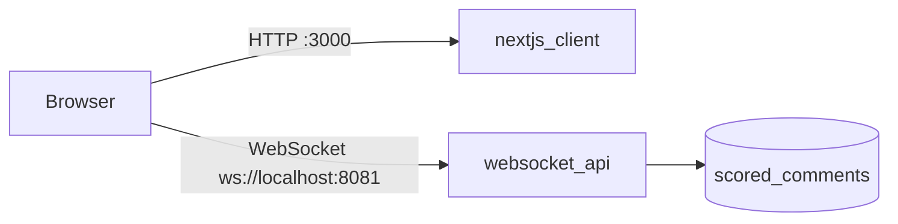

# Frontend Dashboard

The `nextjs_client` service is the real-time command center UI: a dark-mode Next.js dashboard that consumes flagged `scored_comments` over WebSocket and renders a live alert feed plus a force-directed graph of toxic conversation clusters. Source code lives in `frontend/`; Docker Compose builds it as the `nextjs_client` service (Week 3, Days 13–16).

## End-to-End Flow



The browser loads the dashboard from `nextjs_client` on port `3000`, then opens a **client-side** WebSocket to `websocket_api` on port `8081`. The Next.js server does not proxy WebSocket traffic — both connections originate in the browser.

!!! important "WebSocket URL must be host-reachable"
    `NEXT_PUBLIC_WS_URL` is inlined at **build time** by Next.js. It must be an address the **browser** can reach — typically `ws://localhost:8081` when accessing the dashboard at `http://localhost:3000`. Do **not** use the internal Docker hostname `ws://websocket_api:8081`; the browser cannot resolve Docker service names.

## Module Map

| Module | Path | Role |
|---|---|---|
| `useWebSocket` | `frontend/hooks/useWebSocket.ts` | Opens WebSocket on mount, parses and validates `ScoredComment` payloads, calls `onMessage` via ref, closes with code 1000 on unmount |
| `LiveFeed` | `frontend/components/LiveFeed.tsx` | Scrolling alert list with **100-item cap** and toxicity color-coding |
| `mapPayloadToGraph` | `frontend/lib/mapPayloadToGraph.ts` | Maps WS payloads to User/Comment nodes and POSTED/REPLIES_TO links; **200 comment-node cap** |
| `NetworkGraph` | `frontend/components/NetworkGraph.tsx` | Force-directed graph via `react-force-graph-2d` (dynamic import, SSR disabled) |
| Layout shell | `frontend/app/layout.tsx`, `frontend/app/page.tsx` | Server Component page shell; client boundaries in `LiveFeed` and `NetworkGraph` |

Supporting UI: `frontend/components/Sidebar.tsx`, `frontend/components/Header.tsx`. Theme tokens in `frontend/app/globals.css` (Tailwind v4 `@theme inline`).

## WebSocket Hook

`useWebSocket` accepts an optional `url` and `onMessage` callback:

```typescript
useWebSocket(options?: {
  url?: string;
  onMessage?: (payload: ScoredComment) => void;
}): { status: ConnectionStatus; error: string | null }
```

Default URL: `process.env.NEXT_PUBLIC_WS_URL ?? "ws://localhost:8081"`.

Each mounted client component (`LiveFeed`, `NetworkGraph`) opens its own WebSocket connection. This is acceptable for the demo; a shared context could deduplicate connections in a future refactor.

## Live Alert Feed

`LiveFeed` prepends each incoming payload and caps the list at **100 items** (`slice(0, 100)`) to prevent unbounded memory growth.

Toxicity styling from `scores.toxicity`:

| Condition | Style |
|---|---|
| `>= 0.8` | Red border/text — high severity |
| `>= 0.5` and `< 0.8` | Amber/orange — flagged, lower severity |

Connection status banners appear at the top of the feed (connecting, error, disconnected).

## Graph Mapping

`mapPayloadToGraph()` converts each `ScoredComment` into a graph **delta** aligned with the Neo4j schema (PRD Section 3.3):

| Graph element | Source field | Node ID convention |
|---|---|---|
| User node | `user_id` | `user:${user_id}` |
| Comment node | `event_id` | `comment:${event_id}` |
| POSTED edge | user → comment | `(User)-[:POSTED]->(Comment)` |
| REPLIES_TO edge | `reply_to_id` | `(Comment)-[:REPLIES_TO]->(Comment)` |

**Stub parent nodes:** Only flagged comments arrive over WebSocket. When a reply references a benign parent via `reply_to_id`, the mapper creates a stub `comment:${reply_to_id}` node so the reply edge can render even though the parent was never broadcast.

State accumulation:

1. `mergeGraphData(existing, delta)` — merge nodes by `id`, links by composite key.
2. `enforceGraphLimits(data, 200)` — evict oldest comment nodes when count exceeds **200**; prune orphaned links and user nodes.

## Force-Directed Graph

`NetworkGraph` dynamically imports `react-force-graph-2d` with `{ ssr: false }` because the library requires browser APIs (`window`, canvas).

Visual encoding:

| Element | Style |
|---|---|
| User nodes | Cyan (`#06b6d4`) |
| Comment nodes | Amber if toxicity ≥ 0.5; red if ≥ 0.8 |
| High-toxicity comments | Red glow via custom `nodeCanvasObject` |
| Node size | Scaled by toxicity for comment nodes |

The graph container uses a `ResizeObserver` to fill the right panel of the dashboard grid.

## Docker

Multi-stage `frontend/Dockerfile` (`node:18-alpine`):

| Stage | Purpose |
|---|---|
| `deps` | `npm ci` from lockfile |
| `builder` | `npm run build` with `NEXT_PUBLIC_WS_URL` build arg |
| `runner` | Copy `.next/standalone` output; non-root `nextjs` user; `EXPOSE 3000` |

`frontend/next.config.ts` sets `output: "standalone"` for the optimized production image.

Compose service (from `docker-compose.yml`):

```yaml
nextjs_client:
  build:
    context: ./frontend
    args:
      NEXT_PUBLIC_WS_URL: ws://localhost:8081
  ports:
    - "3000:3000"
  depends_on:
    - websocket_api
```

## Verification

**Docker (full stack):**

```bash
docker-compose down -v
docker-compose up --build -d
```

Open <http://localhost:3000> — the left column shows scrolling flagged alerts; the right column renders an animating force graph. Both update in real time as the pipeline streams.

**Bare-metal development (optional):**

```bash
docker-compose up -d kafka producer_service ml_consumer websocket_api
cd frontend
npm install
npm run dev
```

Open <http://localhost:3000>. WebSocket still targets `ws://localhost:8081` by default.

## Related Pages

- [WebSocket API](websocket_api.md) — upstream filter and broadcast
- [Data Pipeline](data_pipeline.md) — `scored_comments` payload schema
- [Architecture](architecture.md) — how the dashboard fits the microservice topology
- [Local Setup](local_setup.md) — full-stack verification steps
