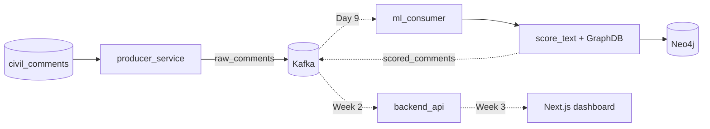

# Real-Time Moderation Engine

A high-throughput, distributed data pipeline that ingests simulated social media traffic, scores it for **toxicity and misinformation in real time**, maps malicious network clusters in a graph database, and (in upcoming phases) streams flagged alerts to a live command-center dashboard.

!!! info "Project status"
    **Week 2 in progress** — infrastructure and the containerized producer are live. The **ml_consumer core logic** (model loading, batched inference, Neo4j graph writes) is implemented; the Kafka consumer loop and Docker integration are next.

## The Pipeline at a Glance

1. The **producer** enriches real comments and streams them into Kafka at ~50 msg/sec.
2. The **ML consumer** runs batched transformer inference and writes conversation graphs to Neo4j — core modules are ready; Kafka wiring is Day 9.
3. The **WebSocket bridge** *(Week 2)* filters for flagged content and pushes it to connected clients.
4. The **dashboard** *(Week 3)* renders a live feed and force-directed graph of toxic clusters.

## Where to Go Next

| Page | What you'll find |
|---|---|
| [Architecture](architecture.md) | Why Kafka, why KRaft, why Neo4j — and how the pieces connect |
| [Local Setup](local_setup.md) | Step-by-step guide from clone to running stack |
| [Data Pipeline](data_pipeline.md) | Topics, payload schemas, and the synthetic graph generator |
| [ML Inference](ml_inference.md) | Model loading, `score_text()`, Neo4j graph writes, smoke tests |
| [PRD](PRD.md) | The full product requirements document |
| [Implementation Plan](implementation_plan.md) | The six-phase build roadmap |

## Tech Stack

**Python 3.13** · **Apache Kafka (KRaft)** · **Neo4j 5** · **PyTorch** · **Hugging Face Transformers** · **Docker Compose** · *upcoming:* Node.js WebSockets, Next.js + Tailwind
