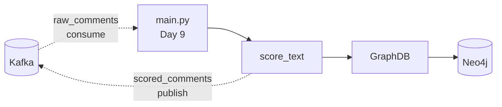

# ML Inference

The **ml_consumer** service is the AI brain of the pipeline: it classifies incoming comments for toxicity, persists the social graph to Neo4j, and (once wired to Kafka) republishes scored events for the WebSocket API.

!!! info "Implementation status"
    **Core logic complete (Days 7–8):** model loading, batched inference, and Neo4j graph writes are implemented as standalone Python modules. **Pending (Day 9+):** Kafka consumer loop (`main.py`), `scored_comments` publishing, and Docker Compose integration.

## Pipeline position



Solid boxes exist today as importable modules; dashed edges are the Day 9 orchestration layer.

## Module map

| Module | Responsibility | Status |
|---|---|---|
| `model_loader.py` | Download and cache `unitary/toxic-bert` + tokenizer | Done |
| `inference.py` | Batched toxicity scoring via `score_text()` | Done |
| `database.py` | Neo4j graph writes via `GraphDB.insert_comment_graph()` | Done |
| `main.py` | Kafka consume → score → graph → publish loop | Planned |

Dependencies are listed in `ml_consumer/requirements.txt`: `torch`, `transformers`, `confluent-kafka`, `neo4j`.

## Model initialization

The default model is **[`unitary/toxic-bert`](https://huggingface.co/unitary/toxic-bert)** — a BERT-based multi-label toxicity classifier. Override at runtime with the `TOXICITY_MODEL_ID` environment variable.

Weights are cached under `ml_consumer/model_cache/` (gitignored). On first run, Hugging Face downloads into that directory; subsequent runs load from disk without re-fetching.

```python
from model_loader import ToxicityModelLoader

loader = ToxicityModelLoader()
tokenizer, model = loader.load()
```

Smoke test: `python model_loader.py` — downloads the model (first run only) and prints tokenized output plus raw logits for a hardcoded string.

## Inference: `score_text()`

`inference.py` exposes the main scoring API:

```python
from inference import score_text

results = score_text(["This is a test comment", "You are an idiot"])
# -> list[dict[str, float]], one dict per input string
```

**Batch processing:** all strings in the batch are tokenized together with padding (`max_length=512`), then forwarded through the model in a single `torch.no_grad()` pass.

**Multi-label, not multi-class:** toxic-bert treats each toxicity dimension independently. Logits are converted with **`torch.sigmoid`**, not softmax.

### Score keys (model output → PRD names)

| Model label | PRD / `scores` key |
|---|---|
| `toxic` | `toxicity` |
| `severe_toxic` | `severe_toxicity` |
| `obscene` | `obscene` |
| `threat` | `threat` |
| `insult` | `insult` |
| `identity_hate` | `identity_attack` |

Probabilities are rounded to four decimal places.

!!! note "Missing label"
    The civil_comments dataset defines seven toxicity dimensions; this model produces **six**. There is no `sexual_explicit` score — do not fabricate one downstream.

Example output for a clearly toxic string:

```json
{
  "toxicity": 0.9859,
  "severe_toxicity": 0.3496,
  "obscene": 0.5458,
  "threat": 0.8785,
  "insult": 0.7339,
  "identity_attack": 0.0683
}
```

Smoke test: `python inference.py` — scores two hardcoded strings (benign vs toxic) and prints the dicts.

## Neo4j graph writes: `GraphDB`

`database.py` implements the PRD Section 3.3 graph schema:

```text
(User)-[:POSTED]->(Comment)-[:REPLIES_TO]->(Comment)
```

### Connection settings

| Variable | Default | Docker Compose value (future) |
|---|---|---|
| `NEO4J_URI` | `bolt://localhost:7687` | `bolt://neo4j:7687` |
| `NEO4J_USER` | `neo4j` | `neo4j` |
| `NEO4J_PASSWORD` | `testpassword` | `testpassword` |

### `insert_comment_graph(payload, scores)`

Accepts a `raw_comments`-shaped payload plus the scores dict from `score_text()`. Each call runs in a single write transaction:

1. **`MERGE` User** on `user_id`
2. **`CREATE` Comment** with `event_id`, `text`, `timestamp`, and `toxicity_score` (from `scores["toxicity"]`)
3. **`CREATE` POSTED** relationship `(User)-[:POSTED]->(Comment)`
4. If `reply_to_id` is present: **`MERGE` parent Comment** (stub if not yet inserted) and **`CREATE` REPLIES_TO** `(Comment)-[:REPLIES_TO]->(parent)`

The parent `MERGE` handles out-of-order replies — a stub node is created when the reply arrives before its parent comment.

```python
from database import GraphDB

with GraphDB() as db:
    db.insert_comment_graph(payload, scores)
```

Smoke test (Neo4j must be running): `python database.py` — inserts one hardcoded test comment. Verify in Neo4j Browser at <http://localhost:7474>.

## Bare-metal development setup

From the repo root:

```powershell
cd ml_consumer
python -m venv venv
.\venv\Scripts\activate          # Windows
# source venv/bin/activate       # macOS / Linux

pip install -r requirements.txt
python model_loader.py             # download + cache model (first run)
python inference.py                # batch scoring smoke test
```

For the Neo4j smoke test, start the database first:

```bash
docker-compose up -d neo4j
cd ml_consumer
python database.py
```

!!! tip "Windows pip TLS error"
    If `pip install` fails with a missing CA bundle path, clear the stale PostgreSQL env var: `$env:CURL_CA_BUNDLE = $null`, then retry.

## What's next (Day 9)

The Kafka orchestration layer will:

1. Subscribe to `raw_comments` and pull batches (e.g. 16 messages)
2. Call `score_text()` on the batch texts
3. Call `insert_comment_graph()` for each payload + scores pair
4. Publish the combined payload to `scored_comments` with an `is_flagged` boolean
5. Commit Kafka offsets only after Neo4j and `scored_comments` writes succeed

See [Data Pipeline](data_pipeline.md) for topic schemas and [Architecture](architecture.md) for the fault-tolerance rationale.
