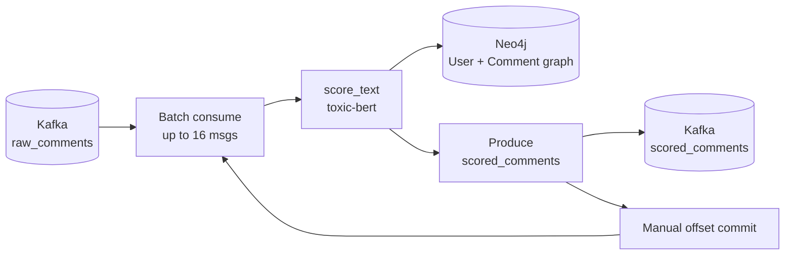
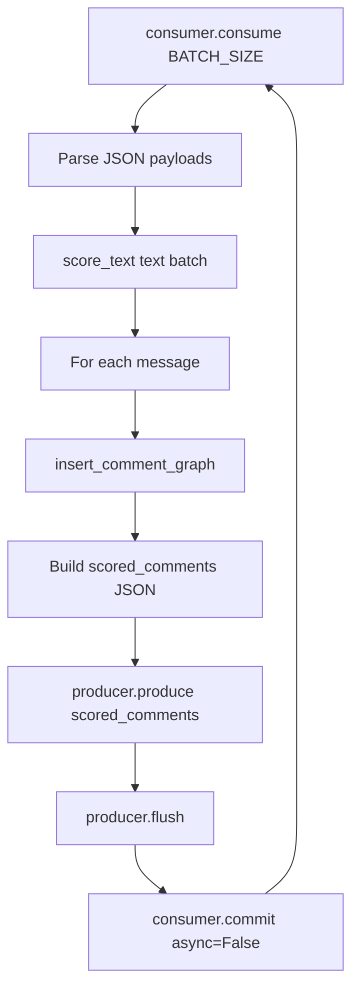

# ML Inference

The `ml_consumer` service consumes enriched comments from Kafka, runs batched transformer inference, writes the social graph to Neo4j, and republishes scored payloads to the `scored_comments` topic. This page is the canonical reference for the ML consumer (Days 7–9).

## End-to-End Flow



Each message is processed exactly once per consumer group: offsets advance only after Neo4j writes and Kafka producer delivery succeed for the entire batch.

## Module Map

| Module | Responsibility |
|---|---|
| `model_loader.py` | Download and cache Hugging Face weights (`unitary/toxic-bert`) |
| `inference.py` | Batched tokenization + sigmoid multi-label scoring |
| `database.py` | Neo4j graph writes (`User`, `Comment`, `POSTED`, `REPLIES_TO`) |
| `main.py` | Kafka consume → score → graph → publish loop with manual commits |

## Model

- **Checkpoint:** [`unitary/toxic-bert`](https://huggingface.co/unitary/toxic-bert) (multi-label sequence classifier)
- **Output:** six independent probabilities via **sigmoid** (not softmax — labels are not mutually exclusive)
- **Score keys:** `toxicity`, `severe_toxicity`, `obscene`, `threat`, `insult`, `identity_attack`
- **Not scored:** `sexual_explicit` — toxic-bert exposes six labels; the civil_comments dataset defines seven

Weights are cached locally at `ml_consumer/model_cache/` (gitignored). The directory is bind-mounted in Docker so downloads survive image rebuilds.

## Kafka Loop

`main.py` orchestrates the pipeline:



Per batch:

1. `consumer.consume(num_messages=BATCH_SIZE, timeout=1.0)` — skip `None` and partition-EOF messages.
2. Parse each value as JSON (see [Data Pipeline](data_pipeline.md) for the `raw_comments` schema).
3. Call `score_text(texts)` for the full batch.
4. For each `(payload, scores)` pair: write to Neo4j, produce to `scored_comments`.
5. `producer.flush()` then `consumer.commit(asynchronous=False)`.

On startup, `ToxicityModelLoader().load()` runs once so the first batch is not delayed by a cold model download.

Consumer configuration:

```python
{
    "bootstrap.servers": BOOTSTRAP_SERVERS,
    "group.id": CONSUMER_GROUP,
    "auto.offset.reset": "earliest",
    "enable.auto.commit": False,
}
```

## Neo4j Graph

Each scored comment creates:

```text
(User {user_id})-[:POSTED]->(Comment {event_id, text, timestamp, toxicity_score})
(Comment)-[:REPLIES_TO]->(Comment)   # when reply_to_id is set
```

The `toxicity_score` property on `Comment` is taken from `scores["toxicity"]`. Reply edges use `MERGE` on the parent comment so relationships form even when the parent arrives later in the stream.

## Environment Variables

| Variable | Default (host) | Docker Compose |
|---|---|---|
| `KAFKA_BOOTSTRAP_SERVERS` | `localhost:9092` | `kafka:29092` |
| `KAFKA_CONSUMER_GROUP` | `ml_consumer_group` | same |
| `RAW_TOPIC` | `raw_comments` | same |
| `SCORED_TOPIC` | `scored_comments` | same |
| `BATCH_SIZE` | `16` | same |
| `CONSUME_TIMEOUT` | `1.0` | same |
| `FLAG_THRESHOLD` | `0.5` | same |
| `NEO4J_URI` | `bolt://localhost:7687` | `bolt://neo4j:7687` |
| `NEO4J_USER` | `neo4j` | same |
| `NEO4J_PASSWORD` | `testpassword` | same |
| `TOXICITY_MODEL_ID` | `unitary/toxic-bert` | same |

`is_flagged` is `true` when `scores["toxicity"] >= FLAG_THRESHOLD`.

## Docker

The `ml_consumer` service in `docker-compose.yml`:

- Builds from `ml_consumer/Dockerfile` (`python:3.13-slim`)
- Depends on `kafka` and `neo4j`
- Mounts `./ml_consumer/model_cache:/app/model_cache` for persistent Hugging Face cache

!!! tip "First start"
    The first container run downloads model weights into the bind-mounted cache. Subsequent rebuilds reuse cached weights. The first **image build** also installs Python dependencies — see [CPU-only PyTorch](#cpu-only-pytorch) below.

## CPU-Only PyTorch

`requirements.txt` pins CPU-only PyTorch via:

```text
--extra-index-url https://download.pytorch.org/whl/cpu
torch
```

The default Linux `torch` wheel on PyPI includes CUDA (~526 MB plus NVIDIA packages). The compose stack has no GPU, so the CPU index keeps Docker builds faster and images smaller. Bare-metal venv installs use the same index for consistency.

## Bare-Metal Development

With Kafka and Neo4j running via Compose:

```bash
cd ml_consumer
python -m venv venv
venv\Scripts\activate        # Windows
# source venv/bin/activate   # macOS / Linux

pip install -r requirements.txt
python main.py
```

Defaults connect to `localhost:9092` and `bolt://localhost:7687` — the host listeners exposed by Compose.

## Fault Tolerance

Offsets commit **only after** Neo4j inserts and `scored_comments` produces succeed for the whole batch. If the consumer crashes mid-batch, uncommitted messages are replayed on restart.

Smoke test:

```bash
docker-compose restart ml_consumer
docker-compose logs -f ml_consumer
```

Processing should resume from the last committed offset without duplicate graph writes for already-committed batches (within the same consumer group).

## Related Pages

- [Data Pipeline](data_pipeline.md) — topic schemas and synthetic graph generation
- [Local Setup](local_setup.md) — verification steps and troubleshooting
- [Architecture](architecture.md) — why Kafka buffering and manual commits matter
