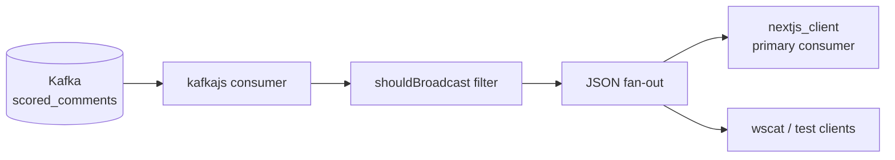

# WebSocket API

The `websocket_api` service bridges Kafka and browser clients: it consumes `scored_comments`, filters for flagged toxicity, and broadcasts matching payloads over WebSockets. Source code lives in `backend_api/`; Docker Compose builds it as the `websocket_api` service (Days 10–12).

## End-to-End Flow



Benign comments never reach connected clients — the bridge drops them before broadcast to save bandwidth (PRD Section 4.3).

## Naming

| Context | Name |
|---|---|
| Source directory | `backend_api/` |
| Docker Compose service | `websocket_api` |
| Kafka consumer group | `websocket-bridge` |
| npm package | `backend_api` |

## Module Map

| Module | Responsibility |
|---|---|
| `kafkaClient.js` | kafkajs client and consumer group configuration |
| `index.js` | Express health endpoint, WebSocket server, Kafka loop, filtering, broadcast |
| `Dockerfile` | `node:18-alpine` production image |

## Kafka Consumer

Configured in `kafkaClient.js`:

```javascript
const broker = process.env.KAFKA_BROKER ?? "localhost:9092";

export const kafka = new Kafka({
  clientId: "backend-api",
  brokers: [broker],
});

export const consumer = kafka.consumer({ groupId: "websocket-bridge" });
```

In `index.js`:

- Subscribes to `scored_comments` with `fromBeginning: false` (only new messages after connect).
- Uses the `websocket-bridge` consumer group — independent from `ml_consumer_group`.

| Setting | Host (bare-metal) | Docker Compose |
|---|---|---|
| Broker | `localhost:9092` | `kafka:29092` via `KAFKA_BROKER` |

Kafka runs in **KRaft mode** — no Zookeeper. Containers reach the broker at `kafka:29092` on `moderation_network`.

## Filtering

Before broadcast, each payload passes `shouldBroadcast()`:

```javascript
function shouldBroadcast(payload) {
  if (!payload.is_flagged) return false;
  const toxicity = payload.scores?.toxicity ?? 0;
  return toxicity >= TOXICITY_THRESHOLD;
}
```

Both checks must pass:

1. `is_flagged` is `true` (set upstream by `ml_consumer` when `toxicity >= 0.5`).
2. `scores.toxicity >= TOXICITY_THRESHOLD` (default `0.5`, env-configurable).

This double gate mirrors PRD 4.3 and prevents overwhelming the frontend with benign traffic.

## WebSocket Server

Startup order in `index.js`:

1. Express app with `GET /health` → `{ "status": "ok" }`.
2. HTTP server + `WebSocketServer` attached on the same port.
3. Kafka consumer connect, subscribe, and `eachMessage` loop.

Broadcast pattern:

```javascript
const data = JSON.stringify(payload);
for (const client of wss.clients) {
  if (client.readyState === WebSocket.OPEN) {
    client.send(data);
  }
}
```

Every connected, open client receives the same flagged payload (pub/sub fan-out).

## Environment Variables

| Variable | Default (host) | Docker Compose |
|---|---|---|
| `KAFKA_BROKER` | `localhost:9092` | `kafka:29092` |
| `PORT` | `8081` | `8081` |
| `TOXICITY_THRESHOLD` | `0.5` | same |

Port `8081` avoids conflict with Kafka UI on `:8080`.

## Docker

`backend_api/Dockerfile`:

```dockerfile
FROM node:18-alpine
WORKDIR /app
COPY package.json package-lock.json ./
RUN npm install --omit=dev
COPY index.js kafkaClient.js ./
EXPOSE 8081
CMD ["node", "index.js"]
```

Compose service (from `docker-compose.yml`):

```yaml
websocket_api:
  build: ./backend_api
  container_name: websocket_api
  depends_on:
    - kafka
  ports:
    - "8081:8081"
  environment:
    KAFKA_BROKER: kafka:29092
    PORT: "8081"
  networks:
    - moderation_network
```

Stateless — no volume mounts. Full E2E requires `producer_service` and `ml_consumer` running to populate `scored_comments`.

## Bare-Metal Development

With infrastructure in Docker:

```bash
docker-compose up -d kafka producer_service ml_consumer

cd backend_api
npm install
node index.js
```

Defaults use `localhost:9092` for Kafka and listen on `:8081`.

## E2E Verification

**Start the full stack:**

```bash
docker-compose down -v
docker-compose up --build -d
docker-compose logs -f websocket_api
```

**Health check:**

```bash
curl http://localhost:8081/health
```

**WebSocket client:**

```bash
npx wscat -c ws://localhost:8081
```

Expect JSON payloads with `is_flagged: true` and `scores.toxicity >= 0.5` only. Benign comments are silently filtered.

**Dashboard (primary consumer):**

Open <http://localhost:3000> — the live alert feed and force-directed graph consume the same WebSocket stream. See [Frontend Dashboard](frontend.md).

## Port Map

| Port | Service | Purpose |
|---|---|---|
| `3000` | `nextjs_client` | Next.js SOC dashboard |
| `8080` | Kafka UI | Topic and consumer inspection |
| `8081` | `websocket_api` | WebSocket + `/health` |
| `7474` | Neo4j | Browser UI |
| `7687` | Neo4j | Bolt protocol |
| `9092` | Kafka | Host listener for local tooling |

## Related Pages

- [Data Pipeline](data_pipeline.md) — `scored_comments` schema
- [ML Inference](ml_inference.md) — upstream scoring and `is_flagged` derivation
- [Frontend Dashboard](frontend.md) — primary WebSocket consumer (live feed + graph)
- [Local Setup](local_setup.md) — full-stack verification steps
- [Architecture](architecture.md) — why Kafka fan-out enables this bridge
